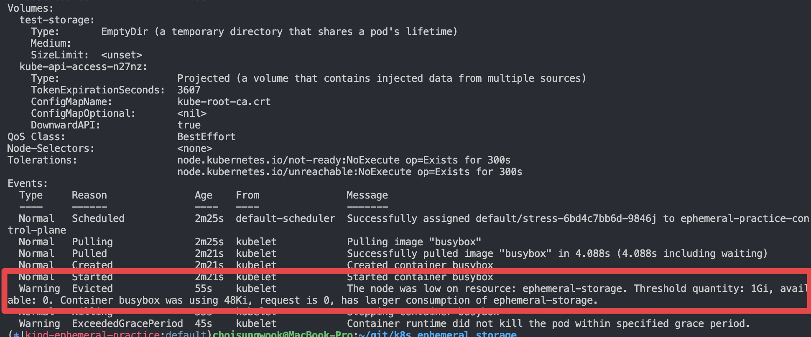
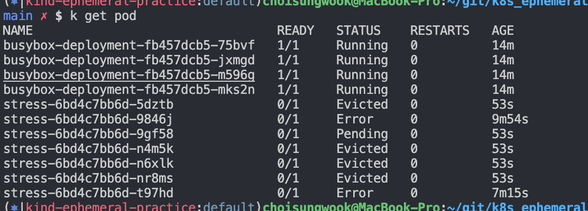
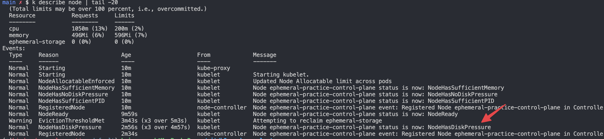
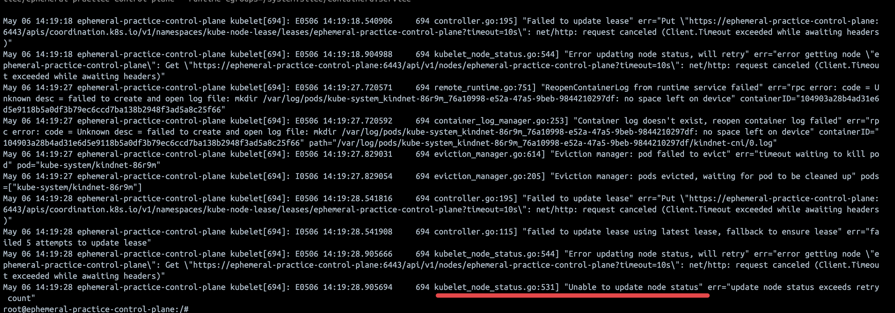

# 개요
* kubernetse ephemeral storage(또는 emptydir)를 잘못사용하도 노드 장애가 발생화는 상황을 재현

# 첫번째 테스트의 로그
* control-plane에서 테스트 진행

## pod 상태



```sh
$ kubectl describe pod
Warning  Evicted              55s    kubelet            The node was low on resource: ephemeral-storage. Threshold quantity: 1Gi, available: 0. Container busybox was using 48Ki, request is 0, has larger consumption of ephemeral-storage.
  Normal   Killing              55s    kubelet            Stopping container busybox
```



```sh
$ kubectl get pod
NAME                                 READY   STATUS    RESTARTS   AGE
busybox-deployment-fb457dcb5-75bvf   1/1     Running   0          10m
busybox-deployment-fb457dcb5-jxmgd   1/1     Running   0          10m
busybox-deployment-fb457dcb5-m596g   1/1     Running   0          10m
busybox-deployment-fb457dcb5-mks2n   1/1     Running   0          10m
stress-6bd4c7bb6d-9846j              0/1     Error     0          6m
stress-6bd4c7bb6d-t97hd              0/1     Pending   0          3m21s
```

## node상태



```sh
$ kubectl describe node

Taints:             <none>
Unschedulable:      false
Lease:
  HolderIdentity:  ephemeral-practice-control-plane
  AcquireTime:     <unset>
  RenewTime:       Mon, 06 May 2024 23:08:38 +0900
Conditions:
  Type             Status  LastHeartbeatTime                 LastTransitionTime                Reason                       Message
  ----             ------  -----------------                 ------------------                ------                       -------
  MemoryPressure   False   Mon, 06 May 2024 23:08:41 +0900   Mon, 06 May 2024 22:55:03 +0900   KubeletHasSufficientMemory   kubelet has sufficient memory available
  DiskPressure     True    Mon, 06 May 2024 23:08:41 +0900   Mon, 06 May 2024 23:08:41 +0900   KubeletHasDiskPressure       kubelet has disk pressure
  PIDPressure      False   Mon, 06 May 2024 23:08:41 +0900   Mon, 06 May 2024 22:55:03 +0900   KubeletHasSufficientPID      kubelet has sufficient PID availa

Events:
Warning  EvictionThresholdMet     3m43s (x3 over 5m3s)   kubelet          Attempting to reclaim ephemeral-storage
  Normal   NodeHasDiskPressure      2m56s (x3 over 4m57s)  kubelet          Node ephemeral-practice-control-plane status is now: NodeHasDiskPressure
  Normal   RegisteredNode           2m34s                  node-controller  Node ephemeral-practice-control-plane event: Registered Node ephemeral-practice-control-plane in Controller
```

# 두번째 워커노드에서 테스트 진행

* controlplane에서 잠시 node not ready상태 점검이 보임


